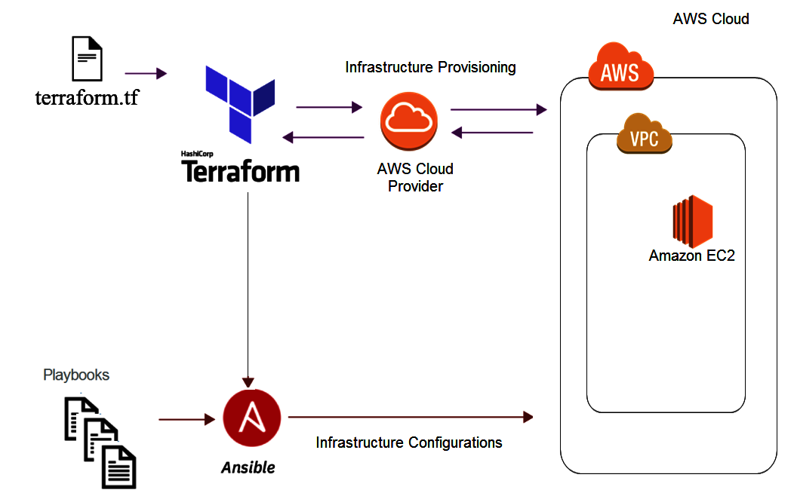

# Hands-On Meetup

# Pre-requisites

1. Install git
1. Install Python3 ( > version 3.6) 
1. Install Terraform
1. Install Ansible
1. Install aws-cli ver2
1. set up an AWS free account

## 1. Install git

click the link and download git on your computer.

https://git-scm.com/download/win

## 2. Install Python3

See the installation guide

https://realpython.com/installing-python/#how-to-check-your-python-version-on-windows

## 3. Install Terraform

see installation guide

https://learn.hashicorp.com/tutorials/terraform/install-cli

## 4. Install Ansible

Once you have your python3 installed, make sure you have pip. Using pip to install Ansible is the easiest

Installing Ansible with pip

https://docs.ansible.com/ansible/latest/installation_guide/intro_installation.html#installing-ansible-with-pip

## 5. Install aws-cli on Windows

See the installation guide

https://docs.aws.amazon.com/cli/latest/userguide/install-cliv2-windows.html#cliv2-windows-install

## 6. Setup a free AWS account

https://aws.amazon.com/premiumsupport/knowledge-center/create-and-activate-aws-account/

See youtube if needed :)
https://youtu.be/pDOvdyOfg7A
